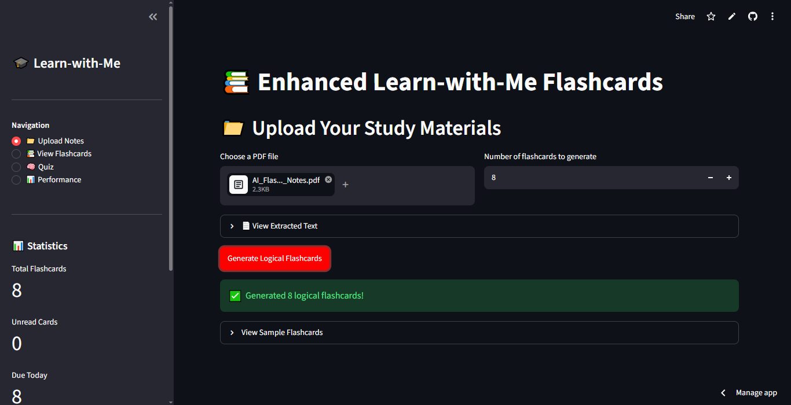
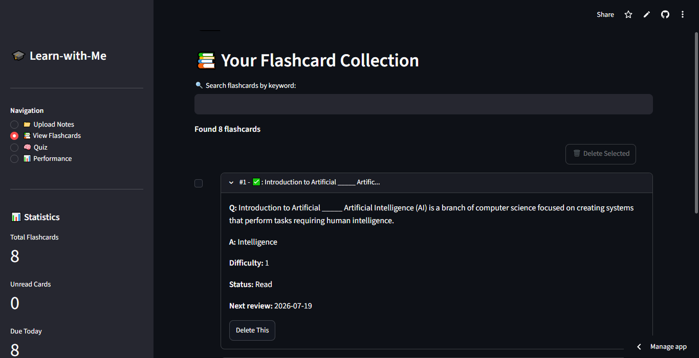
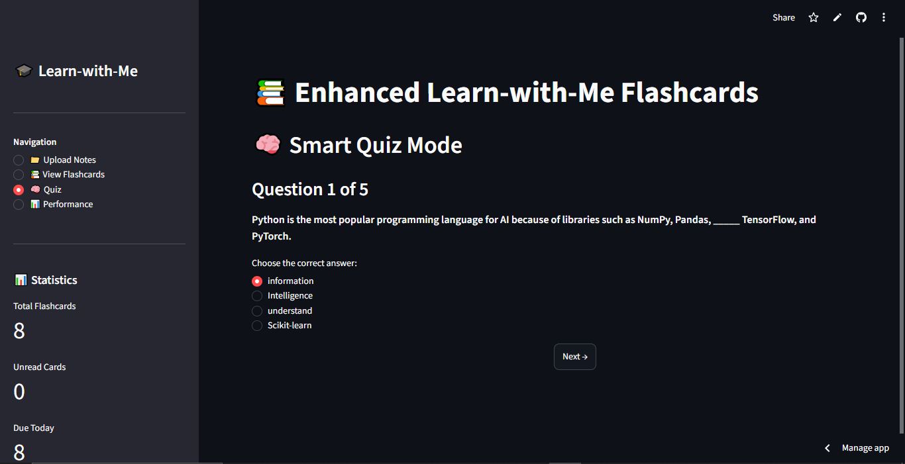
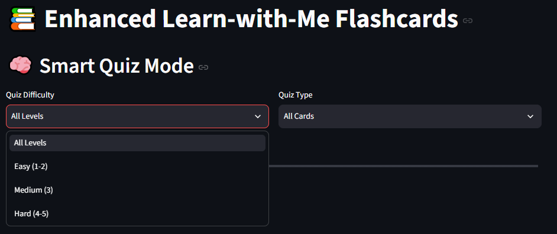
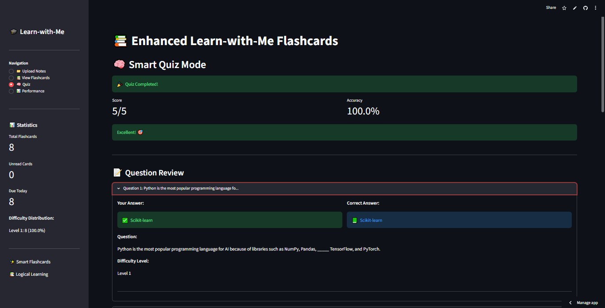
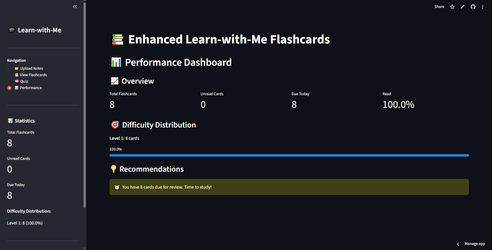

# 🎓 Learn-with-Me Flashcard App

A smart AI-powered study application built with **Python** and **Streamlit** that transforms PDF notes into interactive flashcards, quizzes, and personalized learning insights.


---

## 🌐 Live Demo

🔗 **Try the application here:**

**https://ai-flashcard-app-lorecdnpmr6kvirhqugy4j.streamlit.app/**

---

## ✨ Features

- 📄 **PDF to Flashcards** – Automatically generate flashcards from uploaded PDF notes.
- 🧠 **Smart Quiz System** – Test your knowledge with multiple difficulty levels.
- 📚 **Interactive Learning** – Review flashcards anytime for effective revision.
- 📊 **Performance Dashboard** – Track quiz scores and learning progress.
- 📝 **Question Review** – Analyze correct and incorrect answers after each quiz.
- 🗑️ **Flashcard Management** – Easily organize and delete flashcards.

---

## 📸 Screenshots

### 🏠 Home Page



### 📚 View Flashcards



### 🧠 Smart Quiz Questions



### 🎯 Quiz Difficulty



### 📝 Question Review



### 📊 Performance Dashboard



---

## 🚀 Installation

### Clone the repository

```bash
git clone https://github.com/SumuCodes/AI-Flashcard-App.git
cd AI-Flashcard-App
```

### Install dependencies

```bash
pip install -r requirements.txt
```

### Run the application

```bash
streamlit run app.py
```

---

## 🛠️ Tech Stack

- Python
- Streamlit
- Pandas
- NumPy
- PyTorch

---

## 📂 Project Structure

```text
AI-Flashcard-App/
│
├── assets/
│   ├── home-page.png
│   ├── performance-dashboard.png
│   ├── question-review.png
│   ├── quiz-difficulty.png
│   ├── smart-quiz.png
│   └── view-flashcards.png
│
├── app.py
├── requirements.txt
├── README.md
└── .gitignore
```

---

## 🚀 Future Improvements

- 👤 User Authentication
- ☁️ Cloud Database Integration
- 📱 Mobile Responsive UI
- 🤖 AI-generated Study Summaries
- 🔄 Spaced Repetition Learning

---

## 👨‍💻 Author

**Sumukh**

- GitHub: https://github.com/SumuCodes
- LinkedIn: https://www.linkedin.com/in/sumukh-364b96422/

---

⭐ If you found this project useful, consider giving it a **star**!
